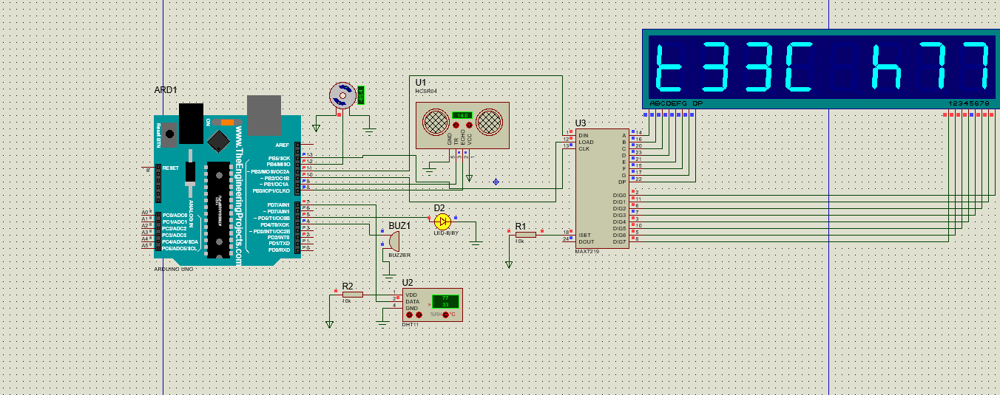
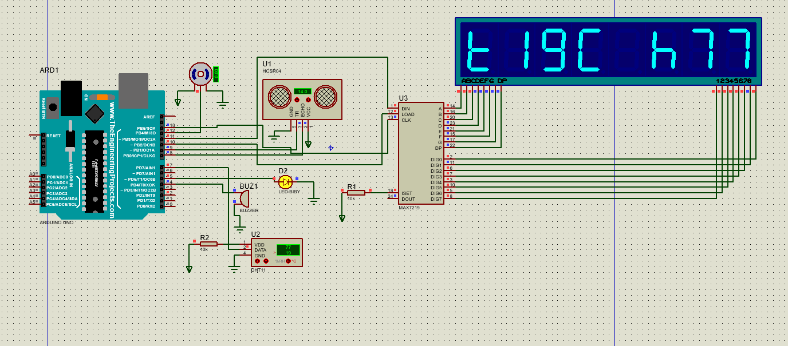
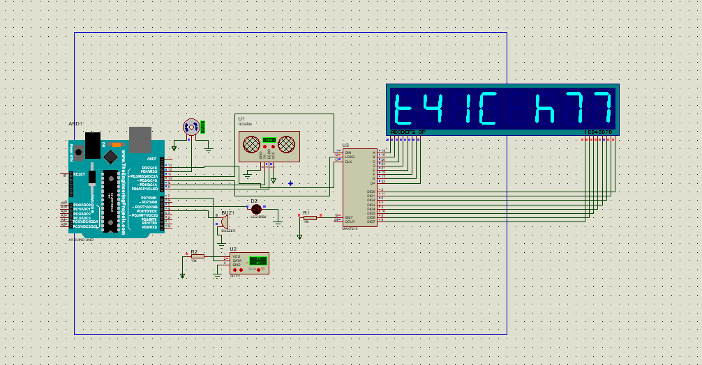

# Smart Chiller

**Anggota Kelompok SSF 19:**
+ Irfan Yusuf Khaerullah -  2206813290
+ Raditya Akhila Ganapati - 2206016151
+ Azriel Dimas Ash-Shidiqi - 2206059414
+ Darren Adam Dewantoro  - 2206816600

# Introduction to the problem and the solution

Perkembangan teknologi dapat mempengaruhi kehidupan termasuk bagaimana kita dapat menyimpan dan menjaga kualiats makanan. Chiller adalah salah satu alat penting yang ada dibutuhkan dalam rumah tangga ataupun indsutri makanan dalam menajaga makanan agar tetap fresh dan sehat. Namun dalam pemanfaatan chiller masih terdapat tantangan dalam penggunaanya seperti mendeteksi suhu agar chiller agar makanan yang disimpan agar tetap fresh, Suhu yang tidak stabil atau berada di luar rentang yang diinginkan dapat menyebabkan kerusakan makanan, yang berpotensi mengakibatkan kerugian ekonomi dan risiko kesehatan. Oleh karena itu pengendalian suhu agar tetap stabil merupakan hal penting dalam menjaga agar kondisi makanan agar tetap fresh dan sehat. Dengan suhu yang stabil maka kualitas makanan yang kita dapat akan ideal dan layak untuk dikonsumsi.

Oleh karena itu Smart Chiller dirancang untuk mengatasi tantangan yang ada dengan mengimplementasikan sesnor dan sistem aktuator. Smart Chiller menggunakan sensor HC-SR04 untuk mendeteksi makanan yang ada didalam chiller. Jika sensor mendeteksi adanya makanan maka sensor DHT11 akan aktif untuk memonitoring suhu pada chiller dan menampilkan datanya di LCD MAX7219. 

Jika suhu terdeteksi berada di nilai yang tidak normal maka akan terdapat aktuator buzzer dan LED yang akan menyaala sebagai peringatan akan adanya masalah suhu pada chiller. Selain itu Servo akan diaktifkan untuk membantu mengembalikan suhu ke kondisi yang normal sehingga makanan yang tidak akan rusak kualitasnya.

# Hardware design and implementation details

### 1.  Arduino UNO 

merupakan mikrokontroller yang berbasi ATmega328P yang terdapat pin input output digital dan analog yang dapat diprogram untuk mengontrol perangkat elektronik. Arduino digunakan untuk mengontrol keseluruhan sistem.

### 2. Sensor HC-SR04

digunakan untuk mendeteksi barang yang ada didalam chiller dalam jarak 15 cm

### 3. Sensor DHT11

sensor yang digunakan untuk membaca temperatur dan kelembapan dimana kedua datanya nanti akan di tampilkan di LCD MAX7219

### 4. LCD MAX7219

berfungsi untuk menampilkan data yang dibaca oleh DHT11 data ini berupa besar suhu dan besar kelembapan

### 5. Servo SG90

ketika temperature yang terdeteksi tinggi, maka servo ini akan menyala yang berperan sebagai kipas untuk mendinginkan suhu

### 6. Buzzer

digunakan sebagai aktuator yang memberikan pertanda jika suhu diatas dari suhu yang sudah ditentukan yaitu 40 derajat.

### 7. LED

digunakan sebagai aktuator yang memberikan pertanda jika suhu dibawah dari suhu yang ditentukan yaitu 20 derajat

### 8. Resistor 

digunakan sebagai hambatan

# Hardware Circuit And Digital Circuit

### Hardware Circuit

### Digital Circuit
 

# Software implementation details
bedasarkan kode yang dibuat, fungsi dari SPI_MAX7219_init berfungsi untuk melakukan inisialisasi yang mengatur moder SPI dan mengirim perintah dan data ke MAX7219 yang berfungsi untuk menontrol seven segment display. fungsi MAX7219_display_digit digunakan untuk menampilkan data awal pada display dan akan ada loop yang memanggil HCSR04_read_distance yang digunakan untuk membaca jarak. Pada subroutine HCSR04_read_distance diatur PINB 1 sebagai trigger dan PINB0 sebagai echo dan akan mengirim trigger pulse ke sensor HCSR04 dan memanggil subroutine echo_PW 

Jika jarak lebih kecil dari 15 maka sensor DHT11 akan menagktfikan activate_dht11 jika tidak maka akan menonaktifkan deactivate_Dht11. Selanjutnya dht11_sensor akan membaca 40 bit data dari sensor d dan meyimpan suhu di register 28 dan 31 yang digunakan dalam display dan control selanjtunya akan memanggil binary_to_decimal untuk mengkonversi data suhu kelembapan menjadi decimal. Selanjutnya DHT11_reading akan membaca bit data dari sensor DHT11 dan menyimpan register 24. 

Selanjutnya subroutine check akan mengcompare suhu yang disimpan di R31 dan menonaktfikan dan aktfikan LED dan Servo berdasarkan hasil comparenya jika suhu lebih besar dari 40 maka servo akan menyala dan buzzer akan berbunyi, jika suhu diantara 30-40 maka Led dan servo akan menyala tetapi Led menyala tidak secara konstan, jika suhu dibawah 20 maka Led akan menyala secara konstan

Slanjutnya ada subroutine display dan delay seperti MAX7219_display_digit yang digunakan digit pada 7 segment display, send_bytes yang digunakan untuk mengirim data ke MAX7219 melalui SPI, binary_to_decimal yang mengkonversi nilai biner suhu atau kelembapan menjadi nilai decimal untuk dsiplau dan fungsi fungsi delay yahg ada untuk memberikan delay menggunakan loop atau timer.

# Testing and performance evaluation

### Jarak <15

saat jarak dibawah 15 cm maka sensor DHT akan membaca data temperature dan komponen komponen yang lain juga akan bekerja dengan baik

### Jarak >15

saat jarak lebih dari 15 cm maka sensor DHT tidak akan bekerja sehingga komponen lain akan membaca data yang terakhir saat sensor DHT berjalan pada contoh diatas sensor jarak disetting ke 22 dan suhu 27. Karena  > 15 cm maka sensor DHT11 tidak akan berjalan dan menampilkan data yang Sensor tersebut baca
### Suhu < 20 

pada saat suhu dibawah 20 derajat maka. Led akan menyala secara konstan 

### Suhu 30 - 40 

pada saat suhu diantara 30 - 40 derajat maka. Led akan menyala tetapi tidak secara konstan dan Servo akan menyala

### Suhu > 40

pada saat suhu diatas 40 derjat maka. Led akan menyala tetapi tidak secara konstan, servo menyala dan buzzer akan menyala dan mengeluarkan bunyi sebagai peringatan bahwa suhu sudah terlalu panas

## Performance

performa dari Smart chiller sudah sesuai dengan kriteria dan harapan yang diinginkan, Tetapi proyek ini juga masih ada kekurangan yaitu seperti Sensor DHT11 yang membaca data tidak selalu cepat sehingga dapat menimbulkan masalah jika membaca datanya terlalu lama. Meskipun begitu, Sensor DHT11 tetap berperan sebagai salah satu sensor utama dalam proyek ini.
servo yang digunakan juga memiliki kekurangan seperti pergerakan kipas yang dimiliki tidak terlalu efisien, meskipun begitu, servo ini tetap digunakan sebagai kipas dalam proyek 

# Conclusion and future work

## Conclusion

Smart Chiller yang kami buat sudah sesuai dengan harapan dan kriteria yang kami tentukan. Alat ini dapat digunakan untuk untuk memonitoring kualitas makanan bedasarkan suhu dari chiller yang menyimpan makanan. Selain itu alat ini memanfaatkan sensor HCSR04 untuk mendeteksi apakah ada makanan atau tidak didalam chiller. Jika terdapat makanan maka akan mengaktifkan Sensor DHT11 jika tidak maka tidak akan mengaktfikan sensor DHT11. Dengan menggunakan sensor DHT11 suhu dapat dibaca secara real time dan ditampilkan melalui LCD MAX7219. Smart chiller juga menggunakan aktuator yang dapat memberikan pertanda ketika chiller berada diluar suhu yang ditentukan seperti led yang akan menyala secara konstan saat suhu dibawah 20 dan led dan servo yang akan menyala saat suhu diantara 30-40 dan led servo dan buzzer yang akan menyala ketika suhu sudah diatas 40 derajat.

Kesimpulan dari proyek Smart Chiller adalah proyek telah bekerja dengan baik dan memberikan output yang sesuai dengan harapan sehingga dari harapan kami alat ini dapat bermanfaat untuk banyak orang.

## Future Work

Smart Chiller dapat memeiliki pengembangan dengan fitur fitur berikut

### 1. Imolementasi Monitoring Jarak Jauh

+ Mengimplementasikan teknologi yang dapat melakukan monitoring dan melakukan kendali dari jarak jauh

### 2. Penambahan Sensor Lanjut

+ Menambahkan Sensor MQ-135 untuk mendeteksi gas yang berbahaya didalam chiller sehingga dapat menandakan kerusakan pada kualitas makanan

### 3. Implementasi User Interface
+ membuat aplikasi mobile untuk memonitoring dan mengontrol chiller dari jarak jauh

+ Meembuat web yang terdapat dashboard yang dapat melakukan monitoring parameter data dan analisis yang lebih baik

